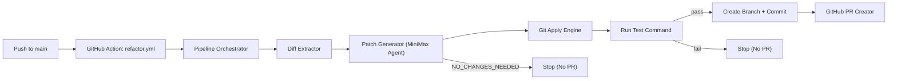

# minimax-refactor-bot

[English](#english) | [Türkçe](#turkce)

## English

A production-ready GitHub automation bot that performs post-merge refactor and optimization using MiniMax through OpenRouter.

It runs after `main` receives a merge commit, analyzes the new diff, asks MiniMax for safe improvements, applies the patch, validates tests, and opens a new pull request.

### Architecture



### How It Works

1. Workflow triggers on `push` to `main`.
2. Bot resolves commit range (`before` -> `after`) from GitHub event payload.
3. Bot extracts unified diff and changed files.
4. If diff exceeds `MAX_DIFF_SIZE`, it splits by file into chunks.
5. MiniMax receives each chunk and returns either a unified diff patch or `NO_CHANGES_NEEDED`.
6. Bot applies patch using `git apply --check --index --3way --recount`.
7. If apply fails, bot asks MiniMax for a repaired patch (up to `PATCH_REPAIR_ATTEMPTS`).
8. Bot runs tests (`TEST_COMMAND`, default `npm test`).
9. If tests pass and changes exist, bot creates branch + commit + PR.

### Project Layout

```text
src/
  ai/
    openrouter-client.ts
    minimax-agent.ts
  git/
    diff.ts
    apply.ts
    branch.ts
    repo-scanner.ts
  github/
    create-pr.ts
  core/
    config.ts
    patch-generator.ts
    pipeline.ts
  index.ts
```

### Install

```bash
npm install minimax-refactor-bot
```

For local development:

```bash
npm ci
npm run build
npm test
```

### Environment Variables

Required:

- `OPENROUTER_API_KEY`
- `GITHUB_TOKEN`
- `GITHUB_REPOSITORY` (e.g. `owner/repo`)

Optional:

- `MODEL_NAME` (default: `minimax/minimax-m2.5`)
- `MAX_DIFF_SIZE` (default: `80000`)
- `MAX_FILES_PER_CHUNK` (default: `1`)
- `TIMEOUT_MS` (default: `60000`)
- `MAX_RETRIES` (default: `2`)
- `PATCH_REPAIR_ATTEMPTS` (default: `2`)
- `TEST_COMMAND` (default: `npm test`)

### Connect to a Repository

1. Add `.github/workflows/refactor.yml` to your repository.
2. Add repository secret `OPENROUTER_API_KEY`.
3. Ensure `GITHUB_TOKEN` has `contents: write` and `pull-requests: write` permissions.
4. Merge a PR into `main`.
5. Bot runs automatically and opens a refactor PR if safe improvements exist.

### CLI Usage

```bash
npx minimax-refactor-bot run
```

### Cost Expectations

Cost depends on diff size, chunk count, model pricing, and retries. Use `MAX_DIFF_SIZE` to control request size and budget exposure.

### Safety Rules

No PR is created when there is no diff, model output is invalid, patch apply fails, or tests fail.

---

## Turkce

`minimax-refactor-bot`, OpenRouter üzerinden MiniMax kullanarak merge sonrası refactor ve optimizasyon yapan, üretim ortamına uygun bir GitHub otomasyon botudur.

`main` dalına merge geldikten sonra yeni diff'i analiz eder, MiniMax'tan güvenli iyileştirmeler ister, patch'i uygular, testleri çalıştırır ve yeni bir pull request açar.

### Mimari

Yukarıdaki diyagram aynı şekilde Türkçe akış için de geçerlidir.

### Nasıl Çalışır

1. Workflow, `main` dalına `push` olunca tetiklenir.
2. Bot, GitHub event payload içinden commit aralığını (`before` -> `after`) çözer.
3. Unified diff ve değişen dosyaları çıkarır.
4. Diff `MAX_DIFF_SIZE` sınırını aşarsa dosya bazında parçalara böler.
5. MiniMax her parça için unified diff patch ya da `NO_CHANGES_NEEDED` döndürür.
6. Patch, `git apply --check --index --3way --recount` ile uygulanır.
7. Apply başarısız olursa bot, `PATCH_REPAIR_ATTEMPTS` kadar MiniMax'tan onarım patch’i ister.
8. Test komutu çalıştırılır (`TEST_COMMAND`, varsayılan `npm test`).
9. Testler geçerse ve değişiklik varsa branch + commit + PR oluşturulur.

### Kurulum

```bash
npm install minimax-refactor-bot
```

Yerel geliştirme:

```bash
npm ci
npm run build
npm test
```

### Ortam Değişkenleri

Zorunlu:

- `OPENROUTER_API_KEY`
- `GITHUB_TOKEN`
- `GITHUB_REPOSITORY` (ör. `owner/repo`)

Opsiyonel:

- `MODEL_NAME` (varsayılan: `minimax/minimax-m2.5`)
- `MAX_DIFF_SIZE` (varsayılan: `80000`)
- `MAX_FILES_PER_CHUNK` (varsayılan: `1`)
- `TIMEOUT_MS` (varsayılan: `60000`)
- `MAX_RETRIES` (varsayılan: `2`)
- `PATCH_REPAIR_ATTEMPTS` (varsayılan: `2`)
- `TEST_COMMAND` (varsayılan: `npm test`)

### Repoya Bağlama

1. `.github/workflows/refactor.yml` dosyasını hedef repoya ekleyin.
2. Repo secret olarak `OPENROUTER_API_KEY` tanımlayın.
3. `GITHUB_TOKEN` izinlerinde `contents: write` ve `pull-requests: write` olduğundan emin olun.
4. `main` dalına bir PR merge edin.
5. Bot, uygunsa otomatik refactor PR açar.

### Maliyet ve Güvenlik

Maliyet; diff boyutu, parça sayısı, model fiyatı ve retry sayısına bağlıdır. `MAX_DIFF_SIZE` ile bütçeyi kontrol edebilirsiniz.

Aşağıdaki durumlarda PR açılmaz:

- diff yoksa
- model çıktısı geçersizse
- patch uygulanamazsa
- testler geçmezse
